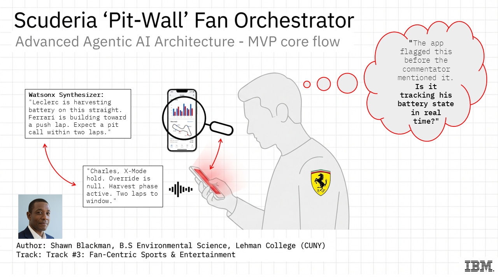
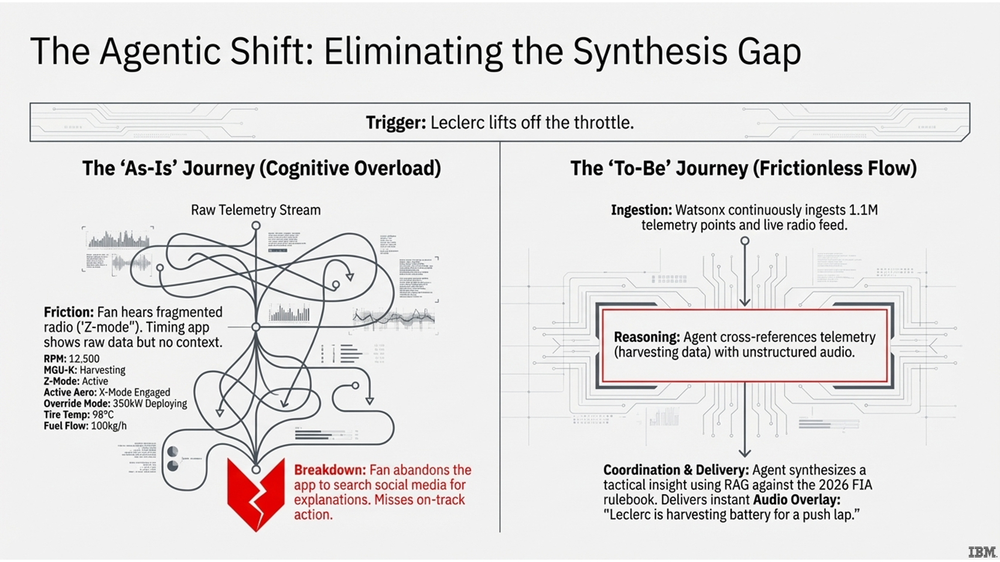
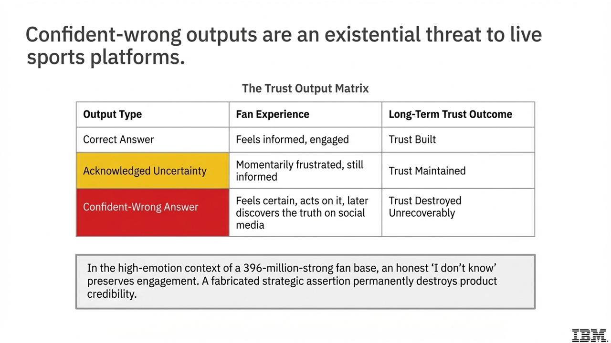
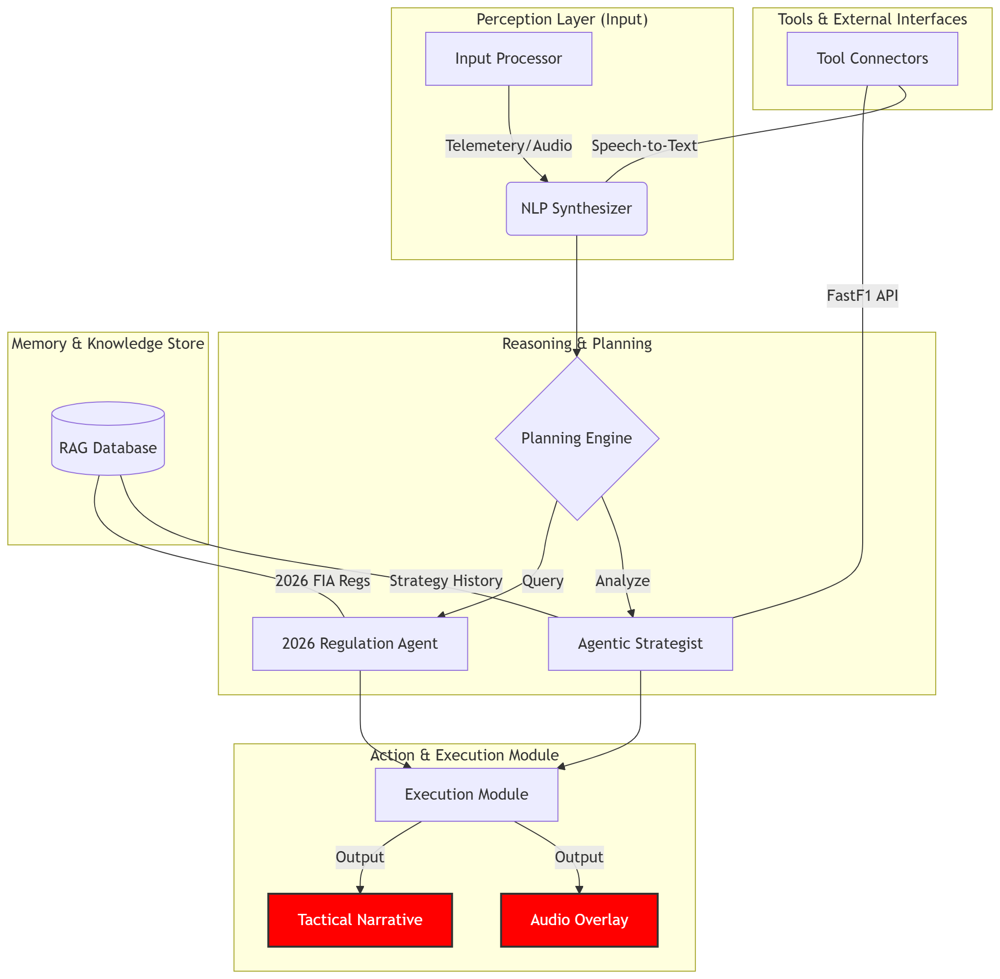
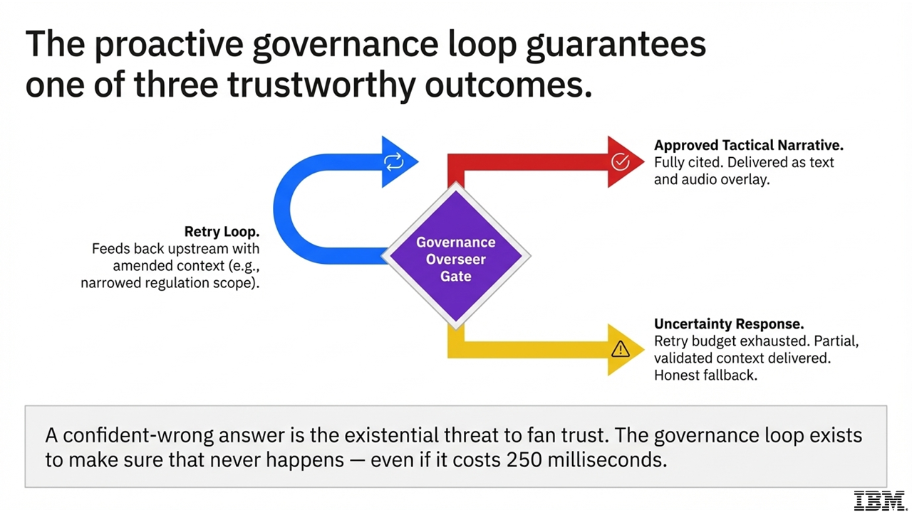

# Scuderia Pit-Wall Fan Orchestrator



**IBM Build Challenge — Track 3: Fan-Centric Sports & Entertainment**  

---

## The Problem



Formula 1's 2026 regulations introduce the most technically complex power unit and aerodynamic rules in the sport's history. F1 cars generate **1.1 million telemetry data points per second**. Pit-wall radio is high-noise, jargon-heavy, and opaque to anyone without an engineering background.

When Leclerc's engineer says *"Charles, X-Mode hold. Override zero. Harvest phase active. Two laps to window"* — 396 million Ferrari fans hear words they cannot translate into strategic meaning.

The current digital ecosystem offers three fragmented channels: a TV broadcast with no technical context, a live timing app with raw data and no explanation, and social media with delayed, unverified commentary. Fans are forced to act as their own data engineers, abandoning the live broadcast to hunt for answers — and missing the race while doing it.

This is the **Synthesis Gap**.

---

## The Solution

The Scuderia Pit-Wall Fan Orchestrator is a multi-agent AI companion powered by **IBM watsonx** that:

- Ingests 1.1M live telemetry data points per second via **FastF1**
- Transcribes and translates unstructured pit-wall radio in real time via **IBM Watson Speech-to-Text**
- Cross-references both against the **FIA 2026 Technical Regulations** using RAG (Retrieval-Augmented Generation)
- Delivers plain-English tactical narratives via text and **IBM Watson Text-to-Speech** audio overlay
- Allows fans to query the system in natural language without looking away from the TV broadcast
- Enforces proactive governance via **IBM watsonx.governance** to guarantee no confident-wrong output ever reaches the fan



> *"Leclerc is harvesting battery on this straight. Ferrari is building toward a push lap. Expect a pit call within two laps."*

---

## Architecture



The system is built across six layers, each mapping to a named component:

```
① Perception          NLP Synthesizer + Watson Speech-to-Text
② Memory & Knowledge  RAG Vector DB (FIA 2026 regs + strategy history)
③ Reasoning           Planning Engine → Regulation Agent | Agentic Strategist
④ Tools               FastF1 API (live telemetry)
⑤ Governance          Proactive Overseer Agent (watsonx.governance)
⑥ Action & Execution  Execution Module → Tactical Narrative + Audio Overlay
```

### The Governance Layer — Why It Exists




A confident-wrong answer is categorically more damaging than acknowledged uncertainty.

A fan who receives *"I cannot confirm this right now"* stays engaged. A fan who receives a confident wrong narrative, feels an emotion about it during a live race, shares it, and later discovers the truth on social media has been actively misled. Trust is gone permanently.

The **Proactive Overseer Agent** intercepts every output at three monitoring hooks before delivery:

- **Hook 1** — Transcript audit (NLP Synthesizer output)
- **Hook 2** — Retrieval audit (RAG Vector DB output)
- **Hook 3** — Pre-delivery cross-validation (citation verified against source)

If cross-validation fails, the Overseer triggers a retry with an amended context and specific failure reason — not a blind retry. If the retry budget is exhausted, the system delivers an honest uncertainty response rather than a confident wrong answer.

**Three possible outputs. No others.**

| Output | Condition | Trust outcome |
|---|---|---|
| Tactical narrative + audio overlay | Citation validated, confidence ≥ 0.7 | Trust built |
| Narrative + audit flag | Retry passed | Trust maintained |
| Uncertainty response | Retry budget exhausted | Trust preserved |

### Latency Budget

| Component | Time |
|---|---|
| First pass (inference + RAG) | ~1,000ms |
| Overseer check | ~150ms |
| Retry with amended context | ~950ms |
| Re-check | ~150ms |
| **Total worst case** | **~2,250ms** |

The 250ms overrun against the 2-second target is an explicit design decision. A 2.25-second validated response is preferable to a 1.8-second confident-wrong one.

---

## Project Structure

```
scuderia-pit-wall-orchestrator/
├── main.py                        # Entry point + MVP demo
├── config.py                      # All credentials and tunable constants
├── models.py                      # Typed data contracts between components
├── perception/
│   └── nlp_synthesizer.py         # Watson STT + Hook 1 audit
├── memory/
│   └── rag_store.py               # RAG Vector DB + Hook 2 audit
├── tools/
│   └── fastf1_client.py           # FastF1 telemetry + Orchestrate skill wrapper
├── reasoning/
│   ├── planning_engine.py         # Intent classification + agent routing
│   ├── regulation_agent.py        # FIA 2026 regulation specialist
│   └── agentic_strategist.py      # Race strategy + live data agent
├── governance/
│   └── overseer.py                # Proactive Overseer + audit log
├── execution/
│   └── execution_module.py        # Watson TTS + three-output delivery + retry loop
└── docs/
    ├── 01_project_overview.md
    ├── 02_architecture_diagram_analysis.md
    ├── 03_sequence_diagram_analysis.md
    ├── 04_governance_guardrails.md
    ├── 05_diagram_explanations_plain_english.md
    ├── 06_final_mermaid_code.md
    └── 07_week4_blueprint_design_decisions.md
```

---

## Prerequisites

- Python 3.12+
- [uv](https://astral.sh/uv) (recommended) or pip
- IBM Cloud account with:
  - watsonx.ai project (Granite model access)
  - Watson Speech-to-Text instance
  - Watson Text-to-Speech instance

---

## Setup

**1. Clone the repository**

```bash
git clone https://github.com/sh4wnbk/scuderia-pit-wall-orchestrator.git
cd scuderia-pit-wall-orchestrator
```

**2. Create and activate the virtual environment**

```bash
uv venv .ibm_scuderia
source .ibm_scuderia/bin/activate
```

**3. Install dependencies**

```bash
uv pip install -r requirements.txt
```

**4. Configure credentials**

```bash
cp .env.example .env
```

Edit `.env` with your IBM Cloud credentials:

```
WATSONX_API_KEY=your_key_here
WATSONX_URL=https://us-south.ml.cloud.ibm.com
WATSONX_PROJECT_ID=your_project_id
WATSON_STT_API_KEY=your_key_here
WATSON_STT_URL=your_url_here
WATSON_TTS_API_KEY=your_key_here
WATSON_TTS_URL=your_url_here
```

**5. Run the MVP demo**

```bash
python main.py
```

The demo indexes a sample FIA regulation document, sets race context to Bahrain 2024 tracking Leclerc, and processes the query: *"Why did Leclerc just lift on the straight? Is the MGU-K failing?"*

---

## IBM Technology Stack

| Component | IBM Product |
|---|---|
| Core LLM | IBM watsonx.ai — Granite 13B Chat v2 |
| Speech transcription | IBM Watson Speech-to-Text |
| Audio delivery | IBM Watson Text-to-Speech |
| Governance & audit | IBM watsonx.governance |
| Agent orchestration | IBM watsonx Orchestrate (target deployment) |

---

## Related Projects

This project's FastF1 telemetry layer is architecturally compatible with [f1-race-replay](https://github.com/IAmTomShaw/f1-race-replay) by Tom Shaw — an interactive F1 race visualisation tool that exposes a real-time telemetry stream designed for developers building custom tools on top of the replay data. The Pit-Wall Fan Orchestrator's AI synthesis layer can sit directly on top of that telemetry stream.

---

## Documentation

Full architectural reasoning, plain-English component explanations, Mermaid diagram code, and design decision rationale are in the [`docs/`](./docs) folder.

---

## License

MIT License. Formula 1 and related trademarks are the property of their respective owners. All telemetry data is sourced from publicly available APIs via FastF1 for educational and non-commercial purposes.
