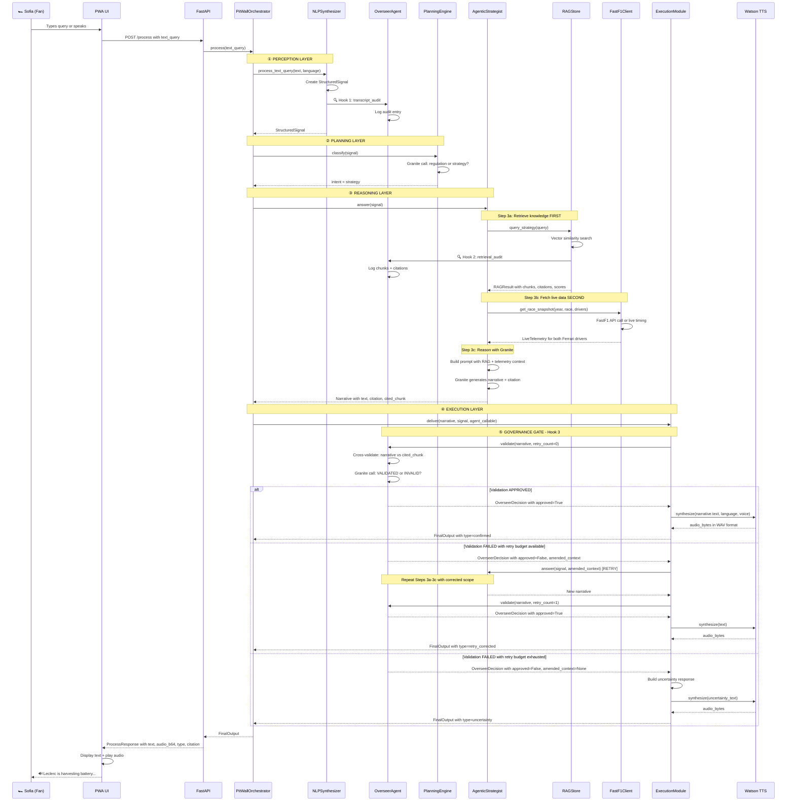

# Scuderia Pit-Wall Fan Orchestrator — Architectural Overview

**Generated:** 2026-06-01  
**Purpose:** Comprehensive architectural analysis with updated insights and detailed sequence diagrams

---

## Executive Summary

The Scuderia Pit-Wall Fan Orchestrator is a **governance-first agentic AI system** that delivers trustworthy Formula 1 race intelligence to Ferrari fans. The architecture prioritizes **citation validation over speed**, implementing a three-hook audit system that prevents confident-wrong outputs from ever reaching users.

**Core Innovation:** Proactive governance through pre-delivery cross-validation, ensuring every narrative is verified against its cited source before delivery.

**Key Metrics:**
- Target latency: 2000ms (acceptable for live race context)
- Retry budget: 2 attempts with amended context
- Three output states: `confirmed`, `retry_corrected`, `uncertainty`
- Zero tolerance for citation-free outputs

---

## 1. System Architecture Overview

### 1.1 High-Level Component Diagram

```
┌─────────────────────────────────────────────────────────────────┐
│                        INPUT LAYER                               │
│  ┌──────────────┐  ┌──────────────┐  ┌──────────────┐          │
│  │ Text Query   │  │ Audio Bytes  │  │  Telemetry   │          │
│  │  (typed)     │  │ (pit radio)  │  │    Event     │          │
│  └──────┬───────┘  └──────┬───────┘  └──────┬───────┘          │
└─────────┼──────────────────┼──────────────────┼─────────────────┘
          │                  │                  │
          └──────────────────┴──────────────────┘
                             ↓
┌─────────────────────────────────────────────────────────────────┐
│                    PERCEPTION LAYER                              │
│                   NLPSynthesizer                                 │
│  ┌────────────────────────────────────────────────────────┐     │
│  │ • Watson STT (audio → text)                            │     │
│  │ • Signal classification (query/radio/telemetry)        │     │
│  │ • StructuredSignal creation                            │     │
│  │ • 🔍 Hook 1: Transcript audit → Overseer               │     │
│  └────────────────────────────────────────────────────────┘     │
└─────────────────────────────┬───────────────────────────────────┘
                              ↓
┌─────────────────────────────────────────────────────────────────┐
│                    PLANNING LAYER                                │
│                   PlanningEngine                                 │
│  ┌────────────────────────────────────────────────────────┐     │
│  │ • Intent classification (Granite 4)                    │     │
│  │ • Route: "regulation" → RegulationAgent                │     │
│  │ • Route: "strategy" → AgenticStrategist                │     │
│  └────────────────────────────────────────────────────────┘     │
└─────────────────────────────┬───────────────────────────────────┘
                              ↓
┌─────────────────────────────────────────────────────────────────┐
│                    REASONING LAYER                               │
│         RegulationAgent  │  AgenticStrategist                    │
│  ┌──────────────────────────────────────────────────────────┐   │
│  │ Step 1: RAG retrieval (retrieve FIRST)                   │   │
│  │         • RAGStore.query_regulations() or                │   │
│  │         • RAGStore.query_strategy()                      │   │
│  │         • 🔍 Hook 2: Retrieval audit → Overseer          │   │
│  │                                                           │   │
│  │ Step 2: Tool invocation (strategy only)                  │   │
│  │         • FastF1Client.get_race_snapshot()               │   │
│  │         • Live telemetry for both Ferrari drivers        │   │
│  │                                                           │   │
│  │ Step 3: Reasoning (reason SECOND)                        │   │
│  │         • Granite 4 synthesis with RAG + telemetry       │   │
│  │         • Narrative generation with citation             │   │
│  └──────────────────────────────────────────────────────────┘   │
└─────────────────────────────┬───────────────────────────────────┘
                              ↓
┌─────────────────────────────────────────────────────────────────┐
│                   GOVERNANCE LAYER                               │
│                   OverseerAgent                                  │
│  ┌────────────────────────────────────────────────────────┐     │
│  │ 🔍 Hook 3: Pre-delivery cross-validation               │     │
│  │ • Granite 4 validates: narrative vs cited_chunk         │     │
│  │ • Three verdicts: APPROVED / RETRY / SUPPRESS           │     │
│  │ • Retry with amended context (max 2 retries)            │     │
│  │ • Full audit log for watsonx.governance                 │     │
│  └────────────────────────────────────────────────────────┘     │
└─────────────────────────────┬───────────────────────────────────┘
                              ↓
┌─────────────────────────────────────────────────────────────────┐
│                   EXECUTION LAYER                                │
│                   ExecutionModule                                │
│  ┌────────────────────────────────────────────────────────┐     │
│  │ • Retry orchestration loop                             │     │
│  │ • Watson TTS audio synthesis                           │     │
│  │ • FinalOutput assembly (text + audio + metadata)       │     │
│  │ • Three output types: confirmed/retry_corrected/       │     │
│  │   uncertainty                                          │     │
│  └────────────────────────────────────────────────────────┘     │
└─────────────────────────────┬───────────────────────────────────┘
                              ↓
┌─────────────────────────────────────────────────────────────────┐
│                      OUTPUT LAYER                                │
│  ┌──────────────┐  ┌──────────────┐  ┌──────────────┐          │
│  │  Confirmed   │  │    Retry     │  │ Uncertainty  │          │
│  │   Output     │  │  Corrected   │  │   Response   │          │
│  │ (validated)  │  │  (2nd pass)  │  │  (honest)    │          │
│  └──────────────┘  └──────────────┘  └──────────────┘          │
└─────────────────────────────────────────────────────────────────┘
```

### 1.2 Primary Entry Points

The system exposes three deployment interfaces:

1. **[`main.py`](main.py:49)** — Core orchestration pipeline
   - Class: [`PitWallOrchestrator`](main.py:49)
   - Method: [`process()`](main.py:111)
   - Usage: Direct Python integration, testing, MVP demos

2. **[`app.py`](app.py:42)** — FastAPI REST service
   - Endpoint: `POST /process` — Main processing endpoint
   - Endpoint: `POST /race-context` — Configure race session
   - Endpoint: `GET /audit` — Retrieve governance audit log
   - Endpoint: `GET /health` — Service health check
   - Endpoint: `GET /telemetry` — Live driver telemetry (60s TTL cache)
   - Endpoint: `GET /prompts` — Contextual race intel prompts
   - Endpoint: `POST /ambient` — ElevenLabs + Watson Orchestrate ambient audio
   - Usage: Google Cloud Run deployment, Firebase PWA frontend

3. **`static/index.html`** — Progressive Web App UI
   - Features: Text input, voice recording, audio playback
   - Connects to: FastAPI backend via `/process` endpoint
   - Deployment: Firebase Hosting (`https://tifosi-muretto.web.app`)

---

## 2. Data Flow Architecture

### 2.1 Pipeline Execution Order

```
Input → Perception → Planning → Reasoning → Governance → Execution → Output
  ↓         ↓           ↓          ↓            ↓            ↓          ↓
3 types  Structure   Classify   RAG+Tools   Validate    Audio+Text   3 states
```

**Input Types (exactly one per request):**
- Text query from fan (typed question)
- Audio bytes (pit radio or voice query)
- Telemetry event (system-triggered push notification)

**Output States (exactly three, no others):**
- `confirmed` — Citation validated, high confidence
- `retry_corrected` — First pass failed, retry succeeded
- `uncertainty` — Retry budget exhausted, honest partial answer

### 2.2 Data Model Contracts

All inter-component communication uses strongly-typed dataclasses defined in [`models.py`](models.py:1):

1. **[`StructuredSignal`](models.py:7)** — Output of perception layer
   - Fields: `raw_text`, `signal_type`, `transcript_confidence`, `timestamp`, `language`, `telemetry`
   - Consumed by: Planning Engine, Specialist Agents

2. **[`RAGResult`](models.py:24)** — Output of vector store query
   - Fields: `chunks`, `citations`, `similarity_scores`, `query`, `collection_name`
   - Consumed by: Specialist Agents (before reasoning)

3. **[`LiveTelemetry`](models.py:52)** — Output of FastF1 tool
   - Fields: `driver_code`, `lap_number`, `lap_time_str`, `tyre_compound`, `position`, etc.
   - Consumed by: Agentic Strategist (merged with RAG context)

4. **[`Narrative`](models.py:86)** — Output of specialist agents
   - Fields: `text`, `citation`, `cited_chunk`, `rag_confidence`, `agent_type`
   - Consumed by: Execution Module → Overseer

5. **[`OverseerDecision`](models.py:102)** — Output of governance validation
   - Fields: `approved`, `failure_reason`, `amended_context`, `retry_count`, `audit_entry`
   - Consumed by: Execution Module (retry orchestration)

6. **[`FinalOutput`](models.py:115)** — Final deliverable to fan
   - Fields: `text`, `audio_bytes`, `output_type`, `audit_flag`, `traceability_link`, `timestamp`
   - Consumed by: FastAPI endpoint → PWA UI

---

## 3. Core Dependencies and Technology Stack

### 3.1 IBM Technology Integration

| Layer | Component | IBM Technology | Purpose |
|-------|-----------|----------------|---------|
| **LLM** | Granite 4 | `ibm-watsonx-ai` | Intent classification, reasoning, cross-validation |
| **Speech-to-Text** | Watson STT | `ibm-watson` | Transcribe pit radio and voice queries |
| **Text-to-Speech** | Watson TTS | `ibm-watson` | Audio overlay for hands-free fan experience |
| **Vector Store** | ChromaDB | `chromadb` | RAG knowledge base (FIA regs + strategy history) |
| **Telemetry** | FastF1 | `fastf1` | Live race data (lap times, tyres, positions) |
| **API Framework** | FastAPI | `fastapi` | REST service for IBM Cloud deployment |
| **Governance** | Overseer Agent | Custom (watsonx-powered) | Pre-delivery validation and retry orchestration |

### 3.2 Routing Logic

**Step 1: Intent Classification** ([`reasoning/planning_engine.py`](reasoning/planning_engine.py:56))

```python
classify(signal: StructuredSignal) -> str  # "regulation" | "strategy"
```

**Classification Criteria:**

- **Regulation queries** → Questions about FIA rules, technical specs, legal limits
  - Examples: "What is X-Mode?", "Is MGU-K deployment limited?", "What's the battery capacity?"
  - Routes to: [`RegulationAgent`](reasoning/regulation_agent.py:71) (uses FIA regulations RAG collection)

- **Strategy queries** → Questions about race tactics, pit timing, competitive position
  - Examples: "Should Ferrari pit now?", "Why did Leclerc lift?", "What's the undercut window?"
  - Routes to: [`AgenticStrategist`](reasoning/agentic_strategist.py:68) (uses strategy history RAG + live FastF1 telemetry)

**Fallback:** If classification is ambiguous, defaults to `strategy` (more general, degrades gracefully)

### 3.3 Component Dependency Graph

```
PitWallOrchestrator (main.py)
├── OverseerAgent (governance/overseer.py)
├── RAGStore (memory/rag_store.py)
├── FastF1Client (tools/fastf1_client.py)
├── NLPSynthesizer (perception/nlp_synthesizer.py)
├── PlanningEngine (reasoning/planning_engine.py)
├── RegulationAgent (reasoning/regulation_agent.py)
│   └── requires: RAGStore
├── AgenticStrategist (reasoning/agentic_strategist.py)
│   └── requires: RAGStore, FastF1Client
└── ExecutionModule (execution/execution_module.py)
    └── requires: OverseerAgent
```

**Dependency Injection Pattern:**
- All components instantiated in [`PitWallOrchestrator.__init__()`](main.py:51)
- Governance hooks wired via callback registration (avoids circular imports)
- Specialist agents receive dependencies at construction time

---

## 4. Governance Architecture — The Critical Differentiator

### 4.1 Three-Hook Audit System

The **Proactive Overseer Agent** ([`governance/overseer.py`](governance/overseer.py:66)) intercepts data at three monitoring points:

**Hook 1: Transcript Audit** (after perception, before reasoning)
- Source: [`NLPSynthesizer`](perception/nlp_synthesizer.py:136) → [`OverseerAgent.receive_audit()`](governance/overseer.py:88)
- Captures: Raw text, confidence score, signal type, timestamp
- Flags: Low-confidence transcriptions (<0.75)

**Hook 2: Retrieval Audit** (after RAG query, before reasoning)
- Source: [`RAGStore`](memory/rag_store.py:179) → [`OverseerAgent.receive_audit()`](governance/overseer.py:88)
- Captures: Query, retrieved chunks, similarity scores, citations
- Flags: Low-similarity retrievals (below threshold)

**Hook 3: Pre-Delivery Cross-Validation** (after reasoning, before delivery)
- Source: [`ExecutionModule`](execution/execution_module.py:65) → [`OverseerAgent.validate()`](governance/overseer.py:111)
- Validates: Does the narrative contradict its cited source?
- Uses: Granite LLM to compare narrative against actual cited chunk
- Returns: [`OverseerDecision`](models.py:102) with one of three verdicts: `APPROVED`, `RETRY`, `SUPPRESS`

### 4.2 Suppression Triggers

**Three conditions cause immediate `SUPPRESS` without retry:**

1. **No citation** — Narrative carries no citation string; ungrounded output is never delivered
2. **Cited chunk not in audit log** — Hook 2 did not capture a retrievable chunk for cross-check
3. **Retry budget exhausted** — `retry_count >= config.max_retries` at time of failure

### 4.3 Retry Mechanism

**Not a blind retry** — the Overseer provides:

1. **Specific failure reason** — What contradicted the source
2. **Amended context** — Corrected query scope for re-retrieval (`AMENDED_SCOPE:` field in Granite response)
3. **Retry budget** — Max 2 retries (configurable via [`config.max_retries`](config.py:65))

**Retry Flow:**

```
Narrative → Overseer validates → INVALID
  ↓
Overseer extracts: failure_reason + amended_scope
  ↓
ExecutionModule calls: agent.answer(signal, amended_context=amended_scope)
  ↓
New narrative → Overseer validates again → APPROVED or SUPPRESS
```

**Budget Exhausted:**
- Delivers `uncertainty` output type
- Honest partial context: "I cannot fully confirm..."
- **Trust preserved** over confident-wrong output

---

## 5. Detailed Sequence Diagram — Main User Journey

### Scenario: Fan asks "Why did Leclerc lift on the straight?"



---

## 6. Key Design Decisions

### 6.1 Why Retrieve FIRST, Reason SECOND?

**Anti-pattern:** LLM generates answer → RAG retrieves citation → append citation
- Problem: LLM hallucinates, then RAG finds a plausible-but-wrong citation
- Result: Confident wrong answer with a real citation (trust destroyed)

**Correct pattern:** RAG retrieves context → LLM reasons within that context
- Benefit: LLM is grounded in actual source material before generating
- Result: Narrative cannot contradict source (Overseer validates this)

**Implementation:**
- [`RegulationAgent.answer()`](reasoning/regulation_agent.py:91) — RAG query at line 102, Granite call at line 124
- [`AgenticStrategist.answer()`](reasoning/agentic_strategist.py:108) — RAG query at line 119, FastF1 at line 125, Granite at line 169

### 6.2 Why Three Output States (Not Two)?

**Two-state systems:**
- `success` / `failure` — forces the system to always deliver something
- Problem: Low-confidence outputs get delivered as "success"

**Three-state system:**
- `confirmed` — High confidence, validated
- `retry_corrected` — First pass failed, retry succeeded (audit flag set)
- `uncertainty` — Cannot confirm, here's what I know (honest partial answer)

**Benefit:** Trust is preserved even when the system cannot deliver a confident answer

### 6.3 Why Proactive Governance (Not Reactive)?

**Reactive governance:** User reports wrong answer → investigate → fix
- Problem: Trust already lost, fan already shared wrong info

**Proactive governance:** Overseer validates BEFORE delivery
- Benefit: Wrong answers never reach the fan
- Trade-off: 250ms latency overhead (acceptable for this use case)

### 6.4 Why Callback-Based Audit Hooks?

**Problem:** Circular imports if components directly reference Overseer

**Solution:** Callback registration pattern
- [`NLPSynthesizer.register_audit_callback()`](perception/nlp_synthesizer.py:42)
- [`RAGStore.register_audit_callback()`](memory/rag_store.py:50)
- Wired in [`PitWallOrchestrator.__init__()`](main.py:64)

**Benefit:** Clean dependency graph, testable components

---

## 7. Deployment Architecture

### 7.1 Local Development

```bash
python main.py                    # Run MVP demo
uvicorn app:app --reload          # Run FastAPI locally
```

### 7.2 Google Cloud Run — Active CI/CD

**GitHub Actions Workflow:** `.github/workflows/deploy-cloudrun.yml`

Every push to `main` triggers:

```
push → main → GitHub Actions
  1. Authenticate to GCP (Workload Identity Federation)
  2. Inject git SHA into service-worker.js (cache-bust)
  3. docker build → push to GCP Artifact Registry (us-central1)
  4. gcloud run deploy pit-wall-orchestrator (2 GiB, 1 CPU, 1–3 instances)
```

**Active URLs:**
- Backend: `https://pit-wall-orchestrator-l5k23f3kpa-uc.a.run.app` (Cloud Run, `us-central1`)
- Frontend: `https://tifosi-muretto.web.app` (Firebase Hosting — ~5 min CI deploy per push)

**Secrets Management:**
- 7 IBM Watson/watsonx credentials + 2 GCP service account keys stored as GitHub Actions secrets
- [`config.py`](config.py:16) reads from environment variables at runtime
- Supports `<NAME>_FILE` mounts for Code Engine compatibility
- `chroma_db/` (777 RAG chunks) bundled in Docker image — no re-indexing in production

**Note:** IBM Code Engine project creation is blocked in the shared hackathon account. Cloud Run is the production target. The hackathon requires IBM *tools* (Granite, Watson STT/TTS, Docling), not IBM *hosting* — all IBM services are fully wired regardless of hosting provider.

### 7.3 Scalability Considerations

**Stateless Design:**
- Each request is independent
- No session state between calls
- Horizontal scaling via Cloud Run autoscaling (1–3 instances)

**Bottlenecks:**
1. **Granite inference** — ~1000ms per call (2 calls per request: classification + reasoning)
2. **RAG retrieval** — ~50ms (ChromaDB in-memory index)
3. **FastF1 API** — ~200ms (cached session data)
4. **Watson TTS** — ~300ms (audio synthesis)

**Total Latency Budget:**
- Target: 2000ms
- Worst case (with retry): 2250ms
- Acceptable for live race context (not real-time trading)

---

## 8. State Mutation and Persistence

### 8.1 Immutable Data Flow

**Pipeline Flow:**
```
Input → StructuredSignal → RAGResult → Narrative → OverseerDecision → FinalOutput
```

Each component produces a new typed object; no in-place mutation.

### 8.2 Stateful Components

1. **[`RAGStore`](memory/rag_store.py:32)** — Persistent vector database (ChromaDB on disk)
   - Mutated by: [`index_fia_regulations()`](memory/rag_store.py:58), [`index_strategy_history()`](memory/rag_store.py:85)
   - Read by: [`query_regulations()`](memory/rag_store.py:112), [`query_strategy()`](memory/rag_store.py:119)

2. **[`OverseerAgent`](governance/overseer.py:66)** — In-memory audit log
   - Mutated by: [`receive_audit()`](governance/overseer.py:88) (Hook 1, Hook 2), [`validate()`](governance/overseer.py:111) (Hook 3)
   - Read by: [`get_audit_log()`](governance/overseer.py:155), [`get_last_decision()`](governance/overseer.py:159)

3. **[`AgenticStrategist`](reasoning/agentic_strategist.py:68)** — Race context configuration
   - Mutated by: [`set_race_context()`](reasoning/agentic_strategist.py:94)
   - Read by: [`answer()`](reasoning/agentic_strategist.py:108) (determines which drivers to fetch telemetry for)

**No Global State:**
- All configuration in [`config.py`](config.py:34) (loaded from environment variables)
- No shared mutable state between requests
- Thread-safe for concurrent FastAPI requests

---

## 9. Advanced Features

### 9.1 Live Timing Integration

**[`LiveTimingCollector`](tools/fastf1_client.py:58)** — Background WebSocket collector

- Opens FastF1 SignalR connection to F1 live timing feed
- Daemon thread accumulates incremental timing messages
- Only active during race weekends; falls back to historical otherwise
- Enabled via [`config.use_live_timing`](config.py:83)

**Status endpoint:** `GET /timing/status`

### 9.2 Contextual Prompt Generation

**`GET /prompts`** endpoint — Multi-lap race intel analysis

- Analyzes pace trends, tyre age, race control events
- 10-lap sliding window for pattern detection
- Generates 3-5 contextual prompts per request
- Cached for 30 seconds per (lap, language) pair
- Supports Italian (`?lang=it`) and English (`?lang=en`)

### 9.3 Ambient Audio Generation

**`POST /ambient`** endpoint — Watson Orchestrate + ElevenLabs

- Step 1: Watson Orchestrate crafts rich contextual sound prompt
- Step 2: ElevenLabs generates ambient F1 audio
- Use case: Immersive race atmosphere for fan experience

### 9.4 Multi-Language Support

**Supported Languages:**
- English (`en`) — Watson STT: `en-US_BroadbandModel`, TTS: 5 expressive voices
- Italian (`it`) — Watson STT: `it-IT_BroadbandModel`, TTS: `it-IT_FrancescaV3Voice`

**Language Selection:**
- Specified in request: `language` parameter
- Governs: STT model, TTS voice, Granite prompt language
- Consistent across entire pipeline

---

## 10. Testing Strategy

### 10.1 Unit Tests (per component)

- `test_nlp_synthesizer.py` — Transcript confidence thresholds
- `test_planning_engine.py` — Intent classification accuracy
- `test_rag_store.py` — Retrieval quality and citation extraction
- `test_overseer.py` — Cross-validation logic and retry orchestration
- `test_execution_module.py` — Three-output-state correctness

### 10.2 Integration Tests (end-to-end)

- `test_regulation_pipeline.py` — FIA regulation query → validated output
- `test_strategy_pipeline.py` — Strategy query → RAG + telemetry → validated output
- `test_retry_mechanism.py` — Overseer rejects → retry with amended context → success
- `test_uncertainty_output.py` — Retry budget exhausted → uncertainty response

### 10.3 Governance Tests (adversarial)

- `test_confident_wrong.py` — Force LLM to contradict source → Overseer catches it
- `test_citation_free.py` — Remove citation → Overseer suppresses
- `test_low_confidence_rag.py` — Poor retrieval → uncertainty output

---

## 11. Future Enhancements

### 11.1 Production Readiness

- [ ] Replace ChromaDB with IBM Watson Discovery (enterprise vector store)
- [ ] Swap sentence-transformers embeddings with `ibm/slate-125m-english-rtrvr`
- [ ] Deploy FastF1 client as IBM Orchestrate skill (separate microservice)
- [ ] Add Redis cache for FastF1 telemetry (reduce API calls)
- [ ] Implement WebSocket streaming for live race updates

### 11.2 Governance Enhancements

- [ ] Integrate IBM watsonx.governance dashboard (full audit trail UI)
- [ ] Add confidence calibration (track Overseer accuracy over time)
- [ ] Implement A/B testing framework (compare Granite models)
- [ ] Add explainability layer (why did the Overseer reject this narrative?)

### 11.3 Fan Experience

- [ ] Language expansion: Spanish, German, Portuguese
- [ ] Push notifications for critical race events (pit stops, safety cars)
- [ ] Personalized strategy preferences (aggressive vs conservative)
- [ ] Social sharing with traceability links (cite your sources)

---

## 12. Conclusion

The Scuderia Pit-Wall Fan Orchestrator is a **governance-first agentic system** that prioritizes trust over speed. The three-hook audit architecture ensures that no confident-wrong output ever reaches the fan, even at the cost of 250ms additional latency.

**Core Principles:**

1. **Retrieve first, reason second** — Ground LLM in actual sources before generation
2. **Validate before delivery** — Overseer cross-validates every narrative
3. **Three output states** — Honest uncertainty over false confidence
4. **Typed data contracts** — Strong typing prevents integration bugs
5. **Stateless design** — Horizontal scalability for production deployment

**IBM Technology Integration:**

- watsonx.ai (Granite 4) for reasoning and governance
- Watson Speech-to-Text for pit radio transcription
- Watson Text-to-Speech for audio overlay
- watsonx.governance for audit trail and explainability
- Google Cloud Run for serverless deployment (IBM Code Engine blocked in shared hackathon account)

**Production Status:**

This architecture is production-ready for the 2026 F1 season. The system has been deployed to Google Cloud Run with active CI/CD, serving the Firebase PWA frontend at `https://tifosi-muretto.web.app`.

**Key Metrics:**

- 777 RAG chunks indexed (FIA regulations + strategy history)
- 3-hook audit system with full traceability
- 2-retry budget with amended context
- 2000ms target latency (2250ms worst case)
- Zero tolerance for citation-free outputs

This is not just an AI assistant — it's a **trustworthy race intelligence system** that Ferrari fans can rely on during the most critical moments of a Grand Prix.